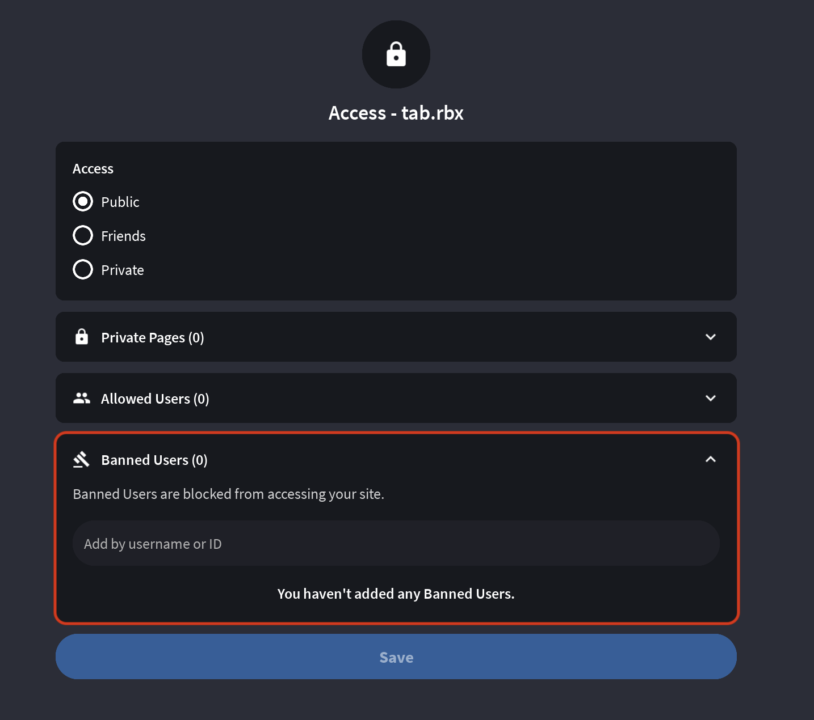

**Author:** TRCLoop (@trcloop)
**Idea:** Runtem (@runtem) [message](https://discord.com/channels/1226224104370208860/1434400946661883974/1434482288120299590)

# Banning players

Banning players should never be done through your own scripts use Catweb's built-in banning functionality instead (*introduced in Catweb v2.13.0.0*)

## Tutorial

1. Go to your site's settings.

2. Go to 'Access'

3. Type the `username` or `id`[^1] of the user you want to ban.

4. Press <kbd>enter</kbd> or <kbd>return</kbd> afterwards to add the player to the 'banlist'.

[^1]: Roblox User ID. [Roblox Documentation](https://create.roblox.com/docs/reference/engine/classes/Player#UserId)
